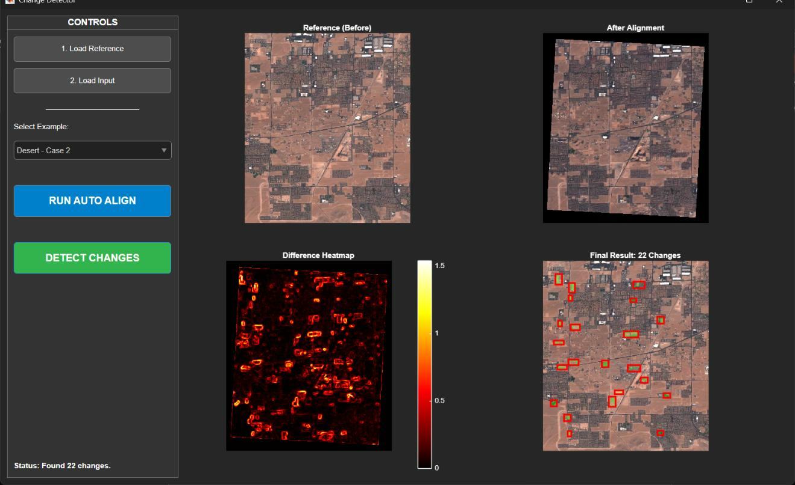

# Satellite Image Change Detector

MATLAB desktop app for detecting changes between two satellite or aerial images of the same area. A reference image and a later image are aligned, normalized, compared with structural similarity, and analyzed for changed regions.



*Screenshot from the supplied project report, showing the saved result for Desert Case 2. It was captured during the original MATLAB project run; the app was not rerun in this environment.*

## How it works

1. Detect and match SURF image features; estimate a projective transform to align the later image to the reference.
2. If too few matches exist, fall back to intensity-based affine registration.
3. Exclude invalid alignment borders and match image histograms to reduce lighting differences.
4. Apply Gaussian smoothing and compute a pixelwise SSIM difference map.
5. Threshold and clean the mask, then draw bounding boxes around connected changed regions.

## Run in MATLAB

Requires MATLAB with **Image Processing Toolbox** and **Computer Vision Toolbox**. Put `AlignmentApp.m` and `Desert_Ref.jpg` plus `Desert_Mov1.jpg` through `Desert_Mov6.jpg` in the same current folder, then run:

```matlab
app = AlignmentApp;
```

Select a Desert case, click **RUN AUTO ALIGN**, then **DETECT CHANGES**. You can also load your own reference and later image with the buttons on the left.

## Files

- `AlignmentApp.m`: application and processing pipeline
- `Desert_Ref.jpg` and `Desert_Mov1.jpg`–`Desert_Mov6.jpg`: sample image pairs
- `assets/demo.svg`: original application screenshot extracted from the supplied report

## Scope and limitations

The count in the screenshot is specific to Desert Case 2. A high difference score is a candidate change; seasonal variation, shadows, or registration errors can also create detections. No accuracy benchmark or labeled ground truth is provided.

**Team:** Nour Salah and Shadi Younis. The private report supplied with this project contains student identity numbers, so it is intentionally excluded from the public source.